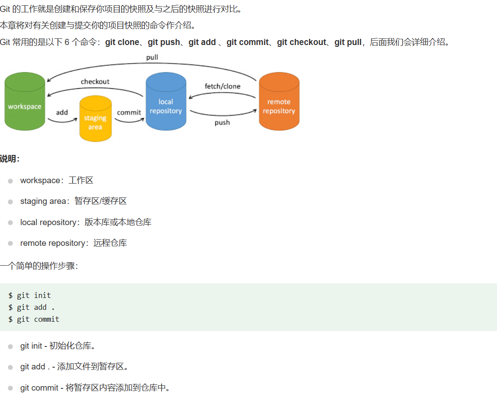

# git学习

### git工作流程

一般情况下：

* 克隆git资源作为工作目录

* 在克隆的资源上添加或修改文件

* 如果其他人修改了，你也可以更新资源

* 在提交前查看修改

* 提交修改

* 在修改完成后，如果发现错误，可以撤回提交并再次修改并提交

  下图展示了git工作流程：

  

### git工作区，暂存区和版本库

* 工作区：就是你在电脑里能看到的目录

* 暂存区：英文叫stage或index。一般存放在.git目录下的index文件（.git/index）中，所以我们把暂存区又是也叫作索引（index）

* 版本库：工作区有一个隐藏目录.git，这个不算工作区，而是git的版本库

  下面这个图展示了工作区、版本库中的暂存区和版本库之间的关系：

  

### git基本操作

 

**创建仓库命令 :**

**提交与修改: **

**提交日志：**

**远程操作: **

### git上传文件代码到github

* 新建空文件夹
* 点进去空文件，鼠标右键，使用Git Bash Here打开
* 打开后出现小窗口，输入 `git init` ，初始化，在本地创建一个Git仓库（此时文件夹就会多出来一个.git的文件，如果没有就请打开隐藏文件）
* 将要上传的文件复制到这个文件夹下
* 输入 `git add .` 将项目添加到暂存区（注意： **.** 前面有空格，代表添加所有文件。若添加单个文件输入：`git add xxxx.xx`（xxxx.xx为文件名））
* 输入 `git commit -m "注释内容"` 将项目提交到Git仓库
* 打开GitHub新建一个仓库
* 输入 `git branch -M main` ，上传到 main 分支
* 输入：`git remote add origin https://github.com/xxxxx/test.git`，和远程仓库连接（注意：xxxxx为自己的GitHub名，test 为仓库名。）
* 输入 `git push -u origin main` 将本地项目推送到远程仓库  有时可能会出现超时的报错，可能因为GitHub是国外的，多试几次。
* 刷新 GitHub 的 test 的仓库页面，上传成功